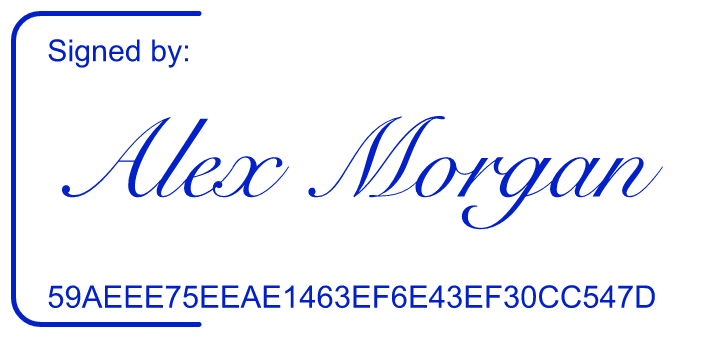

# stamp

Create signature graphics, company seals, personal chops, and office stamps as
physically sized SVG and print-ready PNG files. The catalog contains 14 base
styles for Hong Kong, mainland China, personal marks, Western office stamps,
and signatures. These are graphic templates; the tool does not register or certify a seal.



## Install

Install the tagged release with [uv's tool installer](https://docs.astral.sh/uv/guides/tools/):

```bash
uv tool install 'git+https://github.com/paperfoot/stamp-cli@v0.3.1'
stamp --help
```

This installs both `stamp` and `stamp-cli`. To work from source:

```bash
git clone https://github.com/paperfoot/stamp-cli.git
cd stamp-cli
uv sync
uv run python -m pytest
```

## Signatures

The short command creates a typed signature in the classic framed layout
and shows its reference by default:

```bash
stamp sign --name 'Alex Morgan' -o signature.png
```

Use a scan or photograph by passing its path. Blank surrounding pixels and
white paper are removed. Every layout grows when the remaining ink is tall,
within a bounded height, while preserving its aspect ratio:

```bash
stamp sign --name 'Alex Morgan' --signature ./signature-scan.png -o signature.png
```

Two quieter compositions are available:

```bash
stamp sign --name 'Alex Morgan' --layout clean --no-show-id --color '#242A30' -o signature.png
stamp sign --name 'Alex Morgan' --layout signature-only -o signature.svg
```

`--show-id` and `--no-show-id` control whether the 32-character hexadecimal
reference is drawn. The computed reference stays in the file metadata either
way. It is a content fingerprint for the generated graphic. It is not proof of
identity, consent, signing time, authentication, or a digital certificate, and
the tool makes no guarantee about the legal effect of a signature.

PNG export removes the source path, EXIF, color profile, and other source image
metadata. Its application metadata contains only the stamp style and optional
reference. Text supplied on the command line remains visible in the finished
graphic, as expected.

## Browse and generate

Search the catalog or build an offline gallery of synthetic examples:

```bash
stamp list signature
stamp list --json
stamp preview --open
```

The 14 base styles are:

- `esign.signature`
- `hk.circle`, `hk.oval`, `hk.rect`
- `personal.name_chop`
- `prc.company_round`, `prc.contract`, `prc.department_round`, `prc.finance`
- `prc.foreign_invested_oval`, `prc.invoice`, `prc.legal_rep`, `prc.state_owned_round`
- `western.text`

Each style also has a human-oriented nested command, such as `stamp hk oval`
or `stamp western text`. Agents can use the registry-generated schema:

```bash
stamp agent-info --json
stamp generate --style hk.oval --params params.json -o company-seal
stamp validate --style hk.oval --params params.json --json
```

Unknown parameters, invalid types, and missing required values are reported as
errors. `agent-info` is generated from the same style definitions used by the
CLI, so its parameter schema and defaults stay aligned with rendering.

## Seal typography

Circular and oval company seals center the visible letter shapes between their
rings. English follows a measured arc without squeezing letters horizontally;
Chinese lines fit inside the actual inner circle or ellipse.

Control tracking independently for English and Chinese:

```bash
stamp hk circle --en 'EXAMPLE COMPANY LIMITED' --zh-line1 '示例有限公司' \
  --en-spacing 2 --zh-spacing 1.5 --no-star -o company-seal.png
```

`--en-spacing` defaults to 1.5 and `--zh-spacing` to 1. Both accept 0–12;
zero explicitly removes added tracking. At the default 42 mm circular size,
one unit is 0.1 mm. An optional `--en-bottom-spacing` sets the circular seal's
lower English arc separately; otherwise it inherits `--en-spacing`.

`--en-size` and `--zh-size` set maximum font sizes. Text reduces only as needed
to fit; inputs that cannot remain legible produce an actionable error. A
center star reserves its own space, including clearance to the Chinese lines.

## Export controls

Every render command supports the same output controls:

| Option | Behaviour |
| --- | --- |
| `-o, --output PATH` | `.svg` or `.png` selects one format; no extension selects both. |
| `--format svg\|png\|both` | Explicitly selects output format. |
| `--width-mm N` | Sets printed width while preserving the style's proportions. |
| `--dpi N` | Sets PNG print resolution; the default is 300 DPI. |
| `--size N` | Sets PNG width in pixels instead of DPI. |
| `--bg COLOR` | Applies the same background to SVG and PNG. |
| `--weathered --seed N` | Applies reproducible wear with the same pattern in SVG and PNG. |
| `--force` | Allows replacement; existing outputs are protected by default. |
| `--open` | Opens the saved result in the default viewer. |
| `--stdout` | Writes one artifact to standard output. |
| `--json` | Emits a machine-readable result or error. |

`--dpi` and `--size` are mutually exclusive. When binary output and `--json`
are used together, the artifact goes to stdout and JSON metadata or errors go
to stderr.

PNG is the reliable choice when typography must look the same on another
device. SVG retains vector geometry but its text requires the same font files
on the viewing or conversion system.

## Inspect and verify

Inspect reports the embedded reference and the exact file checksum:

```bash
stamp inspect signature.png
stamp inspect signature.png --json
```

Record that SHA-256 somewhere separate, then compare the file later:

```bash
stamp verify signature.png --sha256 0123456789abcdef0123456789abcdef0123456789abcdef0123456789abcdef
```

Replace the example value with the original 64-character checksum from your
separate record. A match means the file bytes have not changed since that
checksum was calculated. It does not authenticate a signer or establish the
origin of a file.

## Fonts and diagnostics

Styles expose `--font`, `--zh-font`, or `--script-font` where relevant. These
accept a documented alias or a font-file path. Inspect available aliases and
run the offline health check with:

```bash
stamp fonts
stamp doctor
```

Inspection and diagnostic commands do not download fonts. If the optional Noto
symbol fonts are missing, fetch their OFL-licensed copies explicitly:

```bash
stamp fonts --fetch
```

Signatures, Hong Kong seals, and personal name chops use measured glyph bounds from
[Pillow `ImageFont.getbbox`](https://pillow.readthedocs.io/en/stable/reference/ImageFont.html#PIL.ImageFont.FreeTypeFont.getbbox)
to fit variable text. PNG export writes print resolution using Pillow's documented
[PNG `dpi` option](https://pillow.readthedocs.io/en/stable/handbook/image-file-formats.html#png).

## Errors and automation

The process exits with `0` on success, `1` for invalid input or a checksum
mismatch, `2` when a required font/runtime resource is missing, `3` when PNG
rasterization is unavailable, and `4` for file I/O failures. With `--json`,
errors include the same exit code in a JSON envelope.

## License

The application code is MIT licensed. Fonts remain under their own licenses;
the optional Noto symbol fonts fetched by `stamp fonts --fetch` use the SIL Open
Font License and are not relicensed by this project's MIT license.
